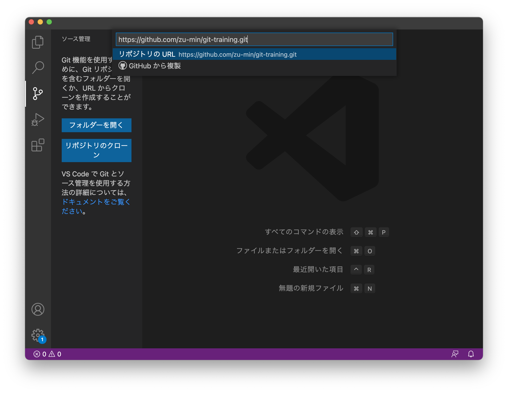
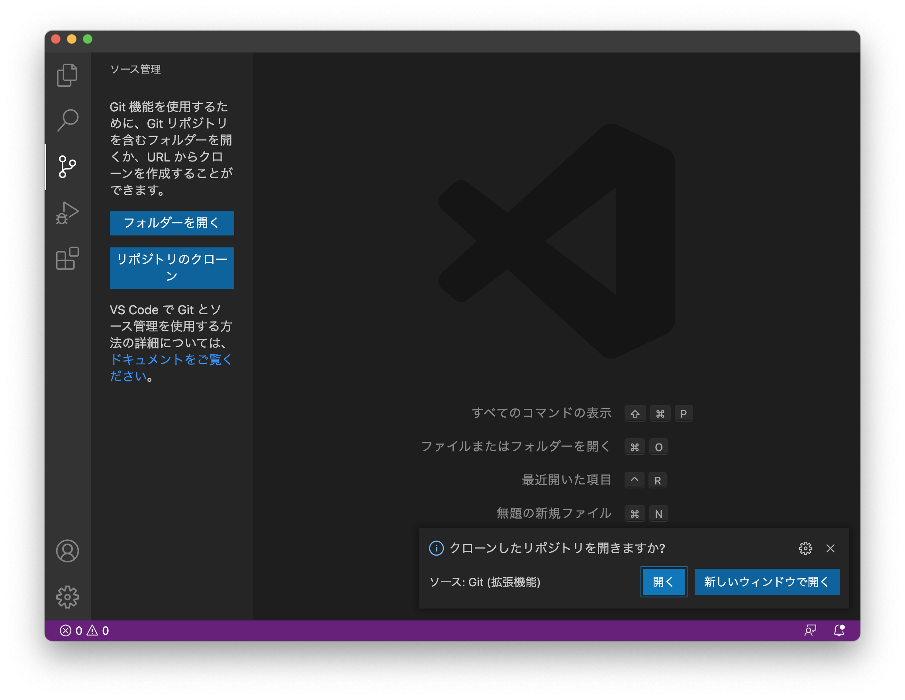
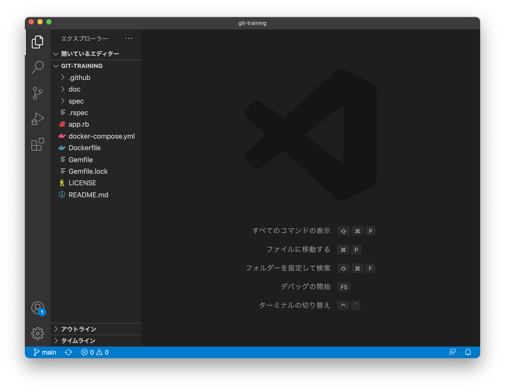

## リポジトリをクローンする

リポジトリのクローンの仕方は、[GitHub 公式ドキュメント](https://docs.github.com/ja/repositories/creating-and-managing-repositories/cloning-a-repository) を参照してください。

公式ドキュメント内では、`octocat/Spoon-Knife ` リポジトリをクローンしていますが、今回はチームメンバーの 1 人がフォークしたリポジトリをクローンします。
ここではフォークしたメンバーを `zu-min` として説明します。

またリポジトリのクローンはターミナルではなく VisualStudio Code を使って行います。

**クローンはチームメンバー全員各々行います。**

1. まず VisualStudio Code の新規ウィンドウを開き左側にある Git を開きます。

2. 次にウィンドウ上部に出てきた入力欄に `zu-min/git-training` のクローン URL を入力します。

3. 入力したらエンターキーを押してクローンします。
   クローンが完了したらウィンドウ右下に通知が出ます。

4. 開くを押して VisualStudio Code で `zu-min/git-training` リポジトリを開きます。

4.1 cloneする際にGitHubのログイン情報を求められたら

https cloneの場合、ユーザ名とパスワードを求められます。
このときに入力するパスワードは、GitHubの設定から作成した個人のアクセストークンを入力します。
GitHubログイン時に使用するパスワードではないことに注意が必要です。

1. 以下の記事で個人アクセストークンの取得手順を行う
  - ⑧で設定する権限はRepoにチェックが入っていれば最低限問題ありません。
[個人アクセストークンを使用する - GitHub Docs](https://docs.github.com/ja/authentication/keeping-your-account-and-data-secure/creating-a-personal-access-token)

2. 作成したアクセストークンをパスワードの代わりに入力する

以上でクローンは完了です。
