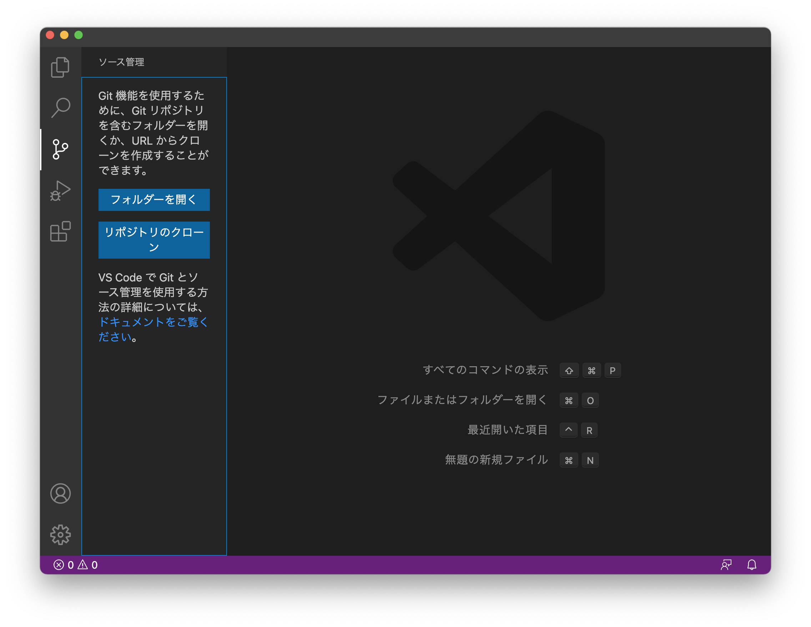

## リポジトリをクローンする

リポジトリのクローンの仕方は、[GitHub 公式ドキュメント](https://docs.github.com/ja/github/creating-cloning-and-archiving-repositories/cloning-a-repository-from-github/cloning-a-repository) を参照してください。

公式ドキュメント内では、`octocat/Spoon-Knife ` リポジトリをクローンしていますが、今回はチームメンバーの 1 人がフォークしたリポジトリをクローンします。
ここではフォークしたメンバーを `zu-min` として説明します。

またリポジトリのクローンはターミナルではなく VisualStudio Code を使って行います。

**クローンはフォークをした人以外のチームメンバーだけが行います。**

1. まず VisualStudio Code の新規ウィンドウを開き左側にある Git を開きます。

2. 次にウィンドウ上部に出てきた入力欄に `zu-min/git-training` のクローン URL を入力します。

3. 入力したらエンターキーを押してクローンします。
   クローンが完了したらウィンドウ右下に通知が出ます。

4. 開くを押して VisualStudio Code で `zu-min/git-training` リポジトリを開きます。

以上でクローンは完了です。
